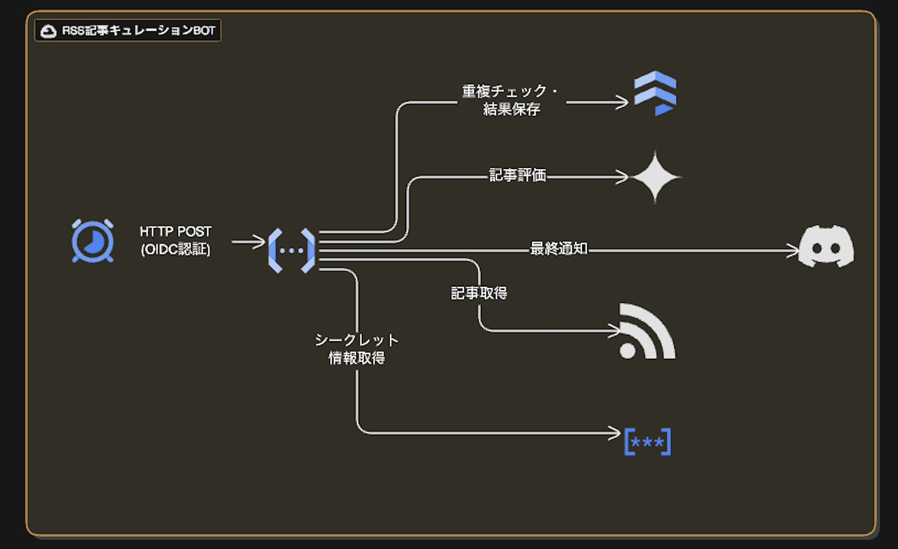

# Terraformインフラ構成

このディレクトリには、RSS記事キュレーションBotのGCPインフラをTerraformで管理する設定が含まれています。

## インフラ構成図



インフラ構成の詳細は [ARCHITECTURE.md](ARCHITECTURE.md) を参照してください。

## 現在のデプロイ状況

### Terraform管理対象

以下のリソースはTerraformで管理されています：

- **Firestore Database** - ネイティブモードデータベース
- **Firestore Index** - TTLインデックス（notified_articles, rejected_articles）
- **Secret Manager** - シークレットリソース（gemini-api-key, discord-webhook-url）
- **Service Account** - Cloud Functions実行用サービスアカウント
- **IAM Bindings** - Secret Manager、Datastore、Functions Invokerの権限
- **Cloud Scheduler** - 毎日9:00 JSTのHTTPトリガージョブ

### 手動デプロイ対象（Terraform管理外）

以下のリソースは**GitHub Actionsで自動デプロイ**されます：

- **Cloud Functions Gen2** - `gcloud functions deploy`コマンドでデプロイ
  - 理由: functions-framework-goを使用したHTTPサーバー実装のため
  - デプロイ: `.github/workflows/deploy.yml`で自動実行

## ディレクトリ構造

```
terraform/
├── modules/              # 再利用可能なTerraformモジュール
│   ├── firestore/       # Firestoreデータベースとインデックス
│   ├── secrets/         # Secret Manager（API Key、Webhook URL）
│   ├── scheduler/       # Cloud Scheduler（HTTPトリガー）
│   └── cloud-function/  # ※未使用（GitHub Actionsでデプロイ）
└── environments/        # 環境別の設定
    └── prod/           # 本番環境
        ├── main.tf
        ├── variables.tf
        ├── outputs.tf
        ├── backend.tf
        └── terraform.tfvars.example
```

## デプロイ手順

### 1. 前提条件

- [Terraform](https://www.terraform.io/downloads) (>= 1.0) がインストールされていること
- [gcloud CLI](https://cloud.google.com/sdk/docs/install) がインストールされ、認証済みであること
- GCPプロジェクト `rss-article-curator-prod` が作成されていること

### 2. GCP認証

```bash
gcloud auth application-default login
gcloud config set project rss-article-curator-prod
```

### 3. 必要なAPIの有効化

```bash
gcloud services enable \
  cloudscheduler.googleapis.com \
  cloudfunctions.googleapis.com \
  firestore.googleapis.com \
  secretmanager.googleapis.com \
  cloudbuild.googleapis.com
```

### 4. 変数ファイルの作成

```bash
cd terraform/environments/prod
cp terraform.tfvars.example terraform.tfvars
# terraform.tfvarsを編集して実際の値を設定
```

### 5. Terraform初期化

```bash
terraform init
```

### 6. プランの確認

```bash
terraform plan
```

### 7. インフラのデプロイ

```bash
terraform apply
```

### 8. シークレットの設定

Terraformでシークレットリソースを作成した後、実際の値を設定します：

```bash
# Gemini API Keyの設定
echo -n "your-actual-gemini-api-key" | \
  gcloud secrets versions add gemini-api-key \
  --project=rss-article-curator-prod \
  --data-file=-

# Discord Webhook URLの設定
echo -n "https://discord.com/api/webhooks/YOUR_WEBHOOK_ID/YOUR_WEBHOOK_TOKEN" | \
  gcloud secrets versions add discord-webhook-url \
  --project=rss-article-curator-prod \
  --data-file=-
```

### 9. Cloud Functionsのデプロイ

Cloud FunctionsはGitHub Actionsで自動デプロイされます：

1. GitHubリポジトリに以下のSecretsを設定：
   - `GCP_SA_KEY`: サービスアカウントのJSONキー

2. `main`ブランチにマージすると自動デプロイが実行されます：
   ```bash
   git checkout main
   git merge feature/your-branch
   git push origin main
   ```

3. GitHub Actionsのログでデプロイ状況を確認

## 手動デプロイ（Cloud Functions）

### functions-framework-goによる実装

このプロジェクトは[functions-framework-go](https://github.com/GoogleCloudPlatform/functions-framework-go)を使用しているため、リポジトリルートから直接デプロイ可能です。

**主な特徴**：
- `package main`のまま動作（コード変換不要）
- `main()`関数でHTTPサーバー起動（ローカルテストとCloud Functions両対応）
- `init()`で関数登録（エントリーポイント定義）

### デプロイコマンド

```bash
# リポジトリルートで実行
cd /path/to/discord-article-bot

# そのままデプロイ（コード変換不要）
gcloud functions deploy rss-article-curator \
  --gen2 \
  --region=asia-northeast1 \
  --runtime=go122 \
  --source=cmd/curator \
  --entry-point=CuratorHandler \
  --trigger-http \
  --no-allow-unauthenticated \
  --service-account=rss-curator-function@rss-article-curator-prod.iam.gserviceaccount.com \
  --memory=512Mi \
  --timeout=3600s \
  --max-instances=1 \
  --min-instances=0 \
  --set-env-vars=CONFIG_URL=https://raw.githubusercontent.com/kaka0913/discord-article-bot/main/config.json,GCP_PROJECT_ID=rss-article-curator-prod,GEMINI_API_KEY_SECRET=gemini-api-key,DISCORD_WEBHOOK_SECRET=discord-webhook-url \
  --project=rss-article-curator-prod
```

**メリット**：
- デプロイプロセスが単純（sed変換不要）
- ローカルテストとCloud Functions実行の一貫性
- メンテナンス性向上

## 管理対象リソース

### Terraformで管理

- **Firestore Database**: ネイティブモード、asia-northeast1リージョン
- **Firestore Index**: TTL自動削除用インデックス
- **Secret Manager**: Gemini API Key、Discord Webhook URLの保存
- **Service Account**: `rss-curator-function@rss-article-curator-prod.iam.gserviceaccount.com`
- **IAM Bindings**:
  - Secret Manager Secret Accessor
  - Cloud Datastore User
  - Cloud Functions Invoker
- **Cloud Scheduler**:
  - スケジュール: `0 9 * * *` (毎日9:00 JST)
  - トリガー: HTTP POST（OIDC認証）
  - タイムアウト: 30分

### GitHub Actionsで管理

- **Cloud Functions Gen2**:
  - ランタイム: Go 1.22
  - メモリ: 512Mi
  - タイムアウト: 60分（3600秒）
  - リージョン: asia-northeast1
  - トリガー: HTTP（認証必須）

## CI/CDパイプライン

### プルリクエスト時

1. ユニットテスト実行
2. config.json検証
3. 結果をPRにコメント

### mainブランチマージ時

1. テスト実行
2. Cloud Functionsデプロイ
   - functions-framework-goによりそのままデプロイ
   - gcloudコマンドで`--source=cmd/curator`を指定
3. デプロイ結果を表示

詳細は[.github/workflows/](../.github/workflows/)を参照。

## 運用

### Cloud Schedulerの一時停止

```bash
gcloud scheduler jobs pause rss-article-curator-job \
  --location=asia-northeast1 \
  --project=rss-article-curator-prod
```

### Cloud Schedulerの再開

```bash
gcloud scheduler jobs resume rss-article-curator-job \
  --location=asia-northeast1 \
  --project=rss-article-curator-prod
```

### 手動実行

```bash
gcloud scheduler jobs run rss-article-curator-job \
  --location=asia-northeast1 \
  --project=rss-article-curator-prod
```

### ログ確認

```bash
# Cloud Functionsのログ
gcloud functions logs read rss-article-curator \
  --region=asia-northeast1 \
  --project=rss-article-curator-prod \
  --limit=50

# Cloud Schedulerのログ
gcloud logging read "resource.type=cloud_scheduler_job" \
  --project=rss-article-curator-prod \
  --limit=50
```

### Firestoreデータ確認

```bash
# GCPコンソールで確認
echo "https://console.cloud.google.com/firestore/databases/-default-/data/panel?project=rss-article-curator-prod"
```

## トラブルシューティング

### Cloud Functionsがタイムアウトする

- Cloud Schedulerの`attempt_deadline`は最大30分（1800秒）
- Cloud Functionsのタイムアウトは60分（3600秒）に設定済み
- Schedulerのリトライで対応

### シークレットが取得できない

サービスアカウントに権限があるか確認：

```bash
gcloud secrets get-iam-policy gemini-api-key \
  --project=rss-article-curator-prod
```

### Firestore書き込みエラー

サービスアカウントに`Cloud Datastore User`ロールがあるか確認：

```bash
gcloud projects get-iam-policy rss-article-curator-prod \
  --flatten="bindings[].members" \
  --filter="bindings.members:rss-curator-function@"
```

## 注意事項

- `terraform.tfvars`は機密情報を含むため、Gitにコミットしないでください（.gitignoreで除外済み）
- Cloud Functionsモジュール（`modules/cloud-function/`）は存在しますが、現在は使用していません
- State管理用のGCSバケットは別途手動で作成する必要があります（backend.tf参照）
- Cloud Schedulerから呼び出される関数は認証必須（`--no-allow-unauthenticated`）
- OIDC認証を使用しているため、外部からの直接呼び出しは不可

## 各モジュールの詳細

各モジュールの詳細は、それぞれのREADME.mdを参照してください：

- [Firestoreモジュール](./modules/firestore/README.md)
- [Secret Managerモジュール](./modules/secrets/README.md)
- [Cloud Schedulerモジュール](./modules/scheduler/README.md)
- [Cloud Functionsモジュール](./modules/cloud-function/README.md) ※現在未使用
